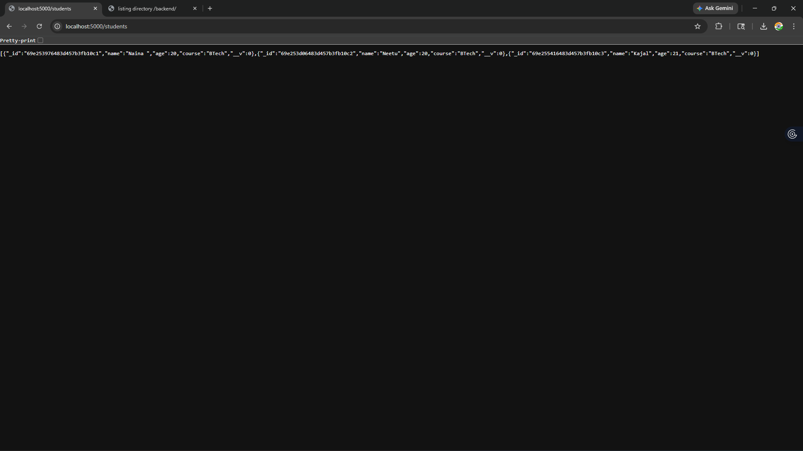
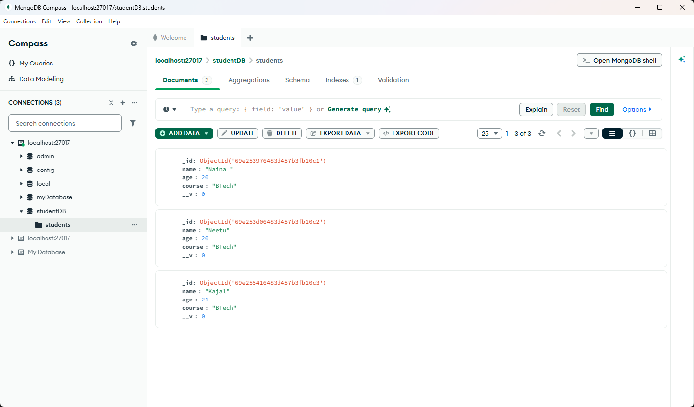
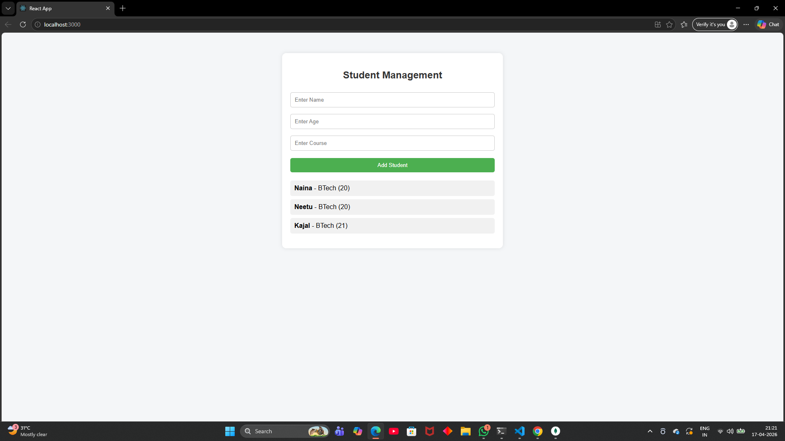

#  Student Management MERN App

##  Features
- Add student details
- View student list
- Data stored in MongoDB

---

##  Tech Stack
- Frontend: React
- Backend: Node.js + Express
- Database: MongoDB

---

##  Project Structure

fullstack/
│
├── backend/
│   ├── server.js
│   ├── models/
│
├── frontend/
│   ├── src/
│   ├── App.js

---

##  How to Run Project

###  Backend

cd backend  
node server.js  

---

###  Frontend

cd frontend  
npm start  

---

##  API Endpoints

- GET /students → Get all students
- POST /students → Add new student

---

## Outputs

### Backend Output

### Database Output

### Frontend Output

---

##  Author
Naina
